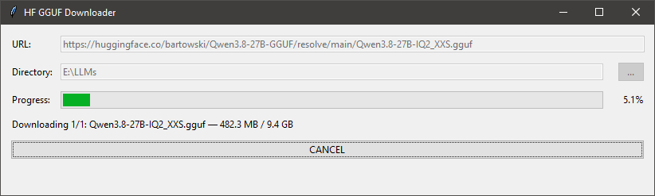

# HF GGUF Downloader

> Unofficial project, not affiliated with Hugging Face.

A minimal Windows desktop application for downloading complete GGUF models from Hugging Face.
Paste a link to any GGUF shard, choose a destination directory, and select **START**. For a filename
such as `model-00001-of-00003.gguf`, the application automatically discovers and downloads all three
parts.



Screenshot from v0.1.0; v0.1.1 also includes a download speed row.

## Features

- accepts a Hugging Face `resolve` URL for any `.gguf` shard,
- automatically expands sharded filenames and verifies every expected part,
- shows per-file and total byte progress,
- shows network download speed in MB/s,
- supports cancellation while preserving resumable partial downloads,
- reuses the Hugging Face cache and credentials,
- works with public, private, and gated repositories,
- builds as a single Windows EXE with PyInstaller.

## How downloads work

The current successor to `huggingface-cli` is the `hf` command. Both are interfaces to the official
`huggingface_hub` Python package. This application calls the same download backend directly because
redirected CLI output does not provide a stable machine-readable progress stream.

Direct integration lets the GUI report byte-level progress, cancel an active worker process, and keep
the partial cache needed to resume a transfer. It also allows the runtime to be packaged without a
separate CLI installation.

See the official [Hugging Face CLI documentation](https://huggingface.co/docs/huggingface_hub/en/guides/cli)
for authentication details.

### Download concurrency

The download worker sets `HF_XET_CLIENT_AC_MAX_DOWNLOAD_CONCURRENCY=128` and
`HF_XET_FIXED_DOWNLOAD_CONCURRENCY=64` by default. In the bundled `hf-xet` version, the explicit
maximum takes precedence over the fixed alias's maximum: transfers start at 64 parallel streams and
adapt within the 64-128 range. These settings control transfers within a file; GGUF shards are still
downloaded one at a time. Existing environment values for these two settings are respected.

High Performance mode is explicitly disabled through both `HF_XET_HIGH_PERFORMANCE=0` and
`HF_XET_HP=0`. The bundled `hf-xet` 1.7.0 uses standard download buffers sized from the machine's
RAM rather than fixed 2 GB / 512 MB / 8 GB values. Higher concurrency does not guarantee faster
downloads; results depend on the network, storage, and server conditions.

Xet transfer telemetry is disabled by default with `HF_XET_TELEMETRY_ENABLED=0`. An existing value
for this environment variable is respected; Hugging Face's global telemetry opt-outs still take
precedence.

### Download speed

The GUI refreshes download speed once per second, averaging network bytes received over the last
three seconds. Cached and previously downloaded bytes are excluded. MB/s uses decimal megabytes.

The display resets to zero after the download stops. It does not enable Xet's outgoing transfer
telemetry.

## Download for Windows

Get the Windows x64 ZIP from [GitHub Releases](https://github.com/PmNz8/SimpleHFDownloader/releases/latest),
extract it, and run `HF-GGUF-Downloader.exe`. Python and a separate CLI installation are not required.

## Run from source

Requirements:

- Windows,
- Python 3.11, 3.12, or 3.13,
- [`uv`](https://docs.astral.sh/uv/).

```powershell
uv sync --group dev
uv run hf-gguf-downloader
```

Public repositories do not require authentication. For private or gated repositories, authenticate
with the standard CLI first, or provide an `HF_TOKEN` environment variable:

```powershell
uv run hf auth login
```

## Destination layout

For a base directory of `E:\LLMs` and the repository `unsloth/Model-GGUF`, downloaded files are stored
under:

```text
E:\LLMs\unsloth\Model-GGUF\<repository subdirectory>\file.gguf
```

The hidden `.cache\huggingface` directory inside the repository folder contains metadata used to skip
completed files and resume interrupted transfers. Do not remove it during a download.

## Tests and checks

```powershell
uv run pytest
uv run ruff check .
uv run ruff format --check src tests scripts
```

## Build the Windows EXE

```powershell
.\build.ps1
```

The build output is written to `dist\HF-GGUF-Downloader.exe`. The script only builds locally; it does
not publish anything.

When distributing the binary, include all three files from `dist`:

- `HF-GGUF-Downloader.exe`,
- `LICENSE.txt`,
- `THIRD_PARTY_NOTICES.txt`.

The executable is not digitally signed.

## License

The current implementation is available under the [MIT License](LICENSE). Notices and license texts
for components bundled into the EXE are listed in [THIRD_PARTY_NOTICES.txt](THIRD_PARTY_NOTICES.txt).
Legacy versions in this repository remain subject to the license included with those versions.

This application does not grant a license to downloaded models. Each model remains subject to the
terms chosen by the author or owner of its Hugging Face repository.
